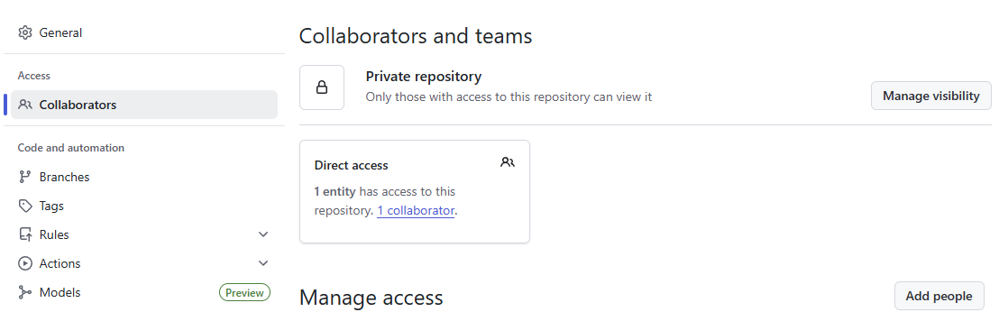
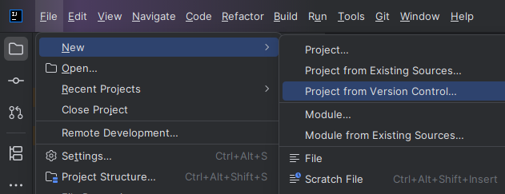
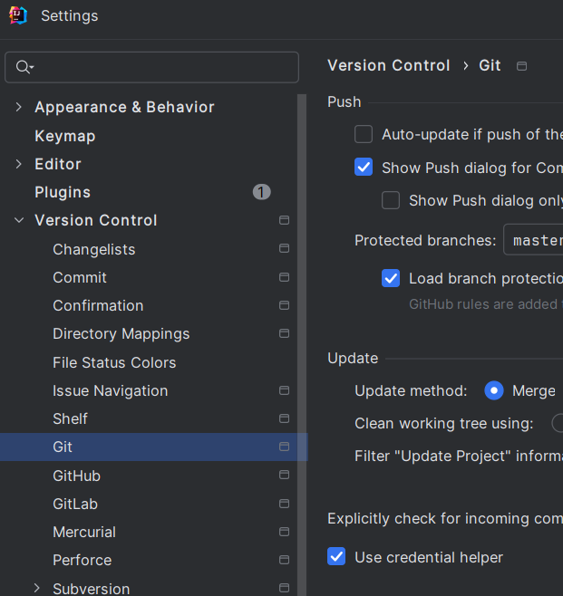
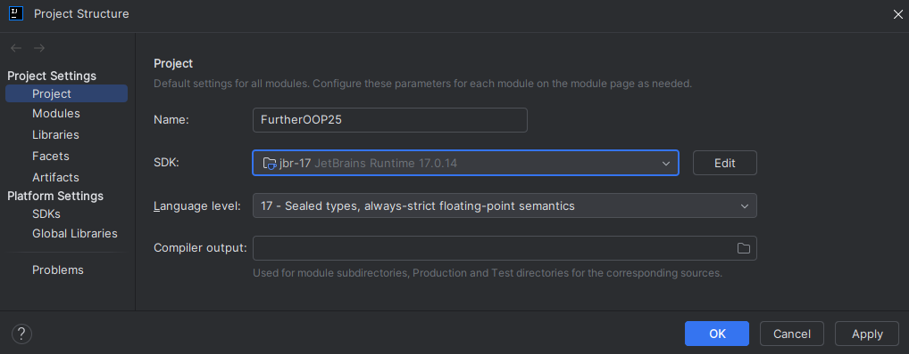
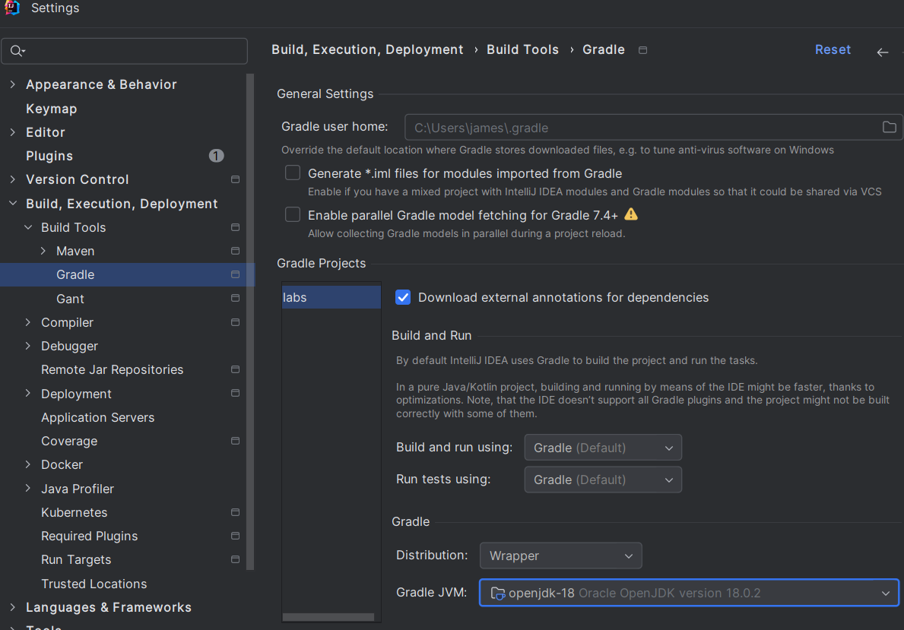
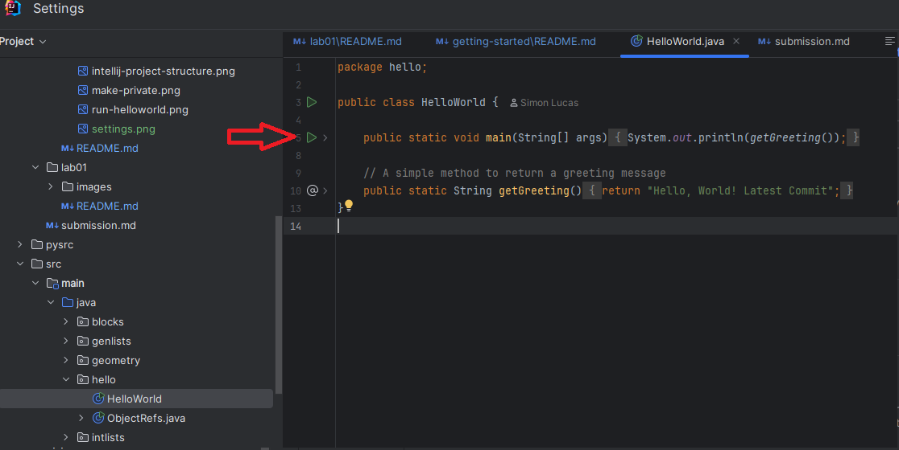

# Getting Started with Further OOP 2026

Follow these steps carefully to connect the public course repository to your
own private QMUL GitHub repository. Do not use a public fork for assessed work.

## 1. Set up your QMUL GitHub access

QMUL GitHub is a separate service from public `github.com`. A `github.com`
account or credential will not give you access to `github.qmul.ac.uk`.

First visit [QMUL GitHub](https://github.qmul.ac.uk/) in a browser and sign in
with your QMUL ITS username and password through Single Sign-On. Complete the
MFA prompt if one appears. Do this before trying to clone: the browser login
confirms that your QMUL account can access the service. If you cannot sign in to
the website, contact the ITS Helpdesk; changing Git settings will not fix an
account or SSO problem.

### Set your commit identity

Git records an author's name and email address in each commit. Configure these
once on each computer that you use, replacing the examples with your details:

```bash
git config --global user.name "A. Student"
git config --global user.email "your-qmul-email@qmul.ac.uk"
```

Check the values with:

```bash
git config --global --get user.name
git config --global --get user.email
```

This identifies your commits; it does **not** sign you in to QMUL GitHub.

### Authenticate Git over HTTPS

The recommended method is the credential manager supplied with a current Git
installation. In IntelliJ, ensure **Use credential helper** is selected. On the
first authenticated clone, fetch or push, the credential manager should open a
browser. Sign in to `github.qmul.ac.uk` with QMUL SSO and approve access if
asked. It then stores the credential in your Windows Credential Manager or
macOS Keychain, rather than in this repository.

Only save a credential when logged into your own operating-system account. Do
not save one under a shared or generic account.

If no browser opens and Git asks directly for a username and password, use your
QMUL GitHub username and a **personal access token** as the password. Do not put
your ITS password or token in a remote URL. To create a token while signed in
to QMUL GitHub, open **Settings → Developer settings → Personal access
tokens**. Prefer a fine-grained token restricted to your coursework repository
with repository contents read/write access. If that option is unavailable, a
classic token needs repository (`repo`) access. Give it a sensible expiry,
copy it when shown, and treat it like a password: never share it, paste it into
source code, or commit it. A manually created token is a fallback; it is not
normally needed when the credential-manager browser flow works.

See the [QMUL GitHub service guidance](https://docs.hpc.qmul.ac.uk/github/) and
[GitHub's credential-manager guidance](https://docs.github.com/en/enterprise-server@latest/get-started/git-basics/caching-your-github-credentials-in-git)
for further details.

## 2. Clone the starter repository

On the public starter repository page, click the green **Code** button and copy
its HTTPS URL. Then clone it in a terminal:

```bash
git clone https://github.qmul.ac.uk/eex250/Further-OOP-26-Starter.git
cd Further-OOP-26-Starter
```

You can also clone it using IntelliJ as described in step 6.

## 3. Create an empty private repository

Sign in to [QMUL GitHub](https://github.qmul.ac.uk/) and create a new
repository owned by your QMUL account. Keep `Further-OOP-26-Starter` as the
repository-name prefix and add your QMUL username, for example
`Further-OOP-26-Starter-abc123`. Set its visibility to **Private**.

Leave all initialisation options unticked: do not add a README, `.gitignore`, or
licence. Initialising it would give it a separate history and make setup and
future updates unnecessarily difficult.

## 4. Connect the public and private repositories

In a terminal opened in the cloned directory, run:

```bash
git remote rename origin upstream
git remote add origin https://github.qmul.ac.uk/abc123/Further-OOP-26-Starter-abc123.git
git push -u origin main
```

Replace `abc123` with your QMUL username. Check the setup with:

```bash
git remote -v
```

You should see `origin` pointing to your private QMUL repository and `upstream`
pointing to the public starter repository. Always push your work to `origin`;
never try to push it to `upstream`.

## 5. Add teaching staff as collaborators

On your private repository, go to **Settings → Collaborators**, click **Add
people**, and invite your instructors:

- Simon Lucas: **eex250**
- James Goodman: **eex859**
- Roman Pretty: **ec22761**




## 6. Open in IntelliJ

If you used the terminal steps above, open the cloned directory with **File →
Open…**. If you have not cloned it yet, use **File → New → Project from Version
Control…** and paste the public starter URL. After cloning, complete step 4 in
IntelliJ's terminal before pushing any work.

Set the Directory to be where you want the project to be stored on your local machine.
The Directory is the location locally where the repository will be stored. If you are using a QMUL
machine do **not** put this on OneDrive as that can interfere with IntelliJ indexing processes.
Instead put this in a new directory on your G-drive (G:). This is your home drive that will follow
you to any QMUL PC.

Click **Clone** to create the local repository, then configure the two remotes
using step 4. Although the starter is readable by QMUL GitHub users, the server
may still ask you to authenticate. Follow step 1 if a browser or credential
prompt appears.



Tick the **Use credential helper** box to allow Git to store your QMUL GitHub
credentials.

If access to your private repository fails, open **File → Settings → Version
Control → Git** and make sure **Use credential helper** is ticked:




## 7. IntelliJ settings

Ensure you are using Java 17 in **File → Project Structure**.



The second place is the Gradle JVM. The setting for this are under File..Settings…Build,
Execution, Deployment…Build Tools…Gradle. Set the Gradle JVM (bottom of the screenshot
below) to be the same as the version used earlier.



You may need to wait a minute or two for Gradle to load in all the libraries. Once this is done
you are ready to run Hello World and start the actual lab work on the next page.

## 8. Sanity check

Run `src/main/java/hello/HelloWorld.java` to confirm setup. You can do this in several ways. The easiest is 
to navigate to the file in the Project Explorer on the left hand side of the IDE, then click the green
arrow next to the main method (highlighted with the red arrow in the diagram below):



## 9. Receive teaching-team updates

Commit your work before incorporating an update. Then run:

```bash
git switch main
git status
git fetch upstream
git merge upstream/main
git push origin main
```

If `git status` shows uncommitted changes, commit or stash them before merging.
If Git reports a merge conflict, it means that you and the teaching team
changed the same part of a file. Resolve the marked conflicts in IntelliJ,
commit the result, and push it to `origin`. Do not use
`--allow-unrelated-histories`; repositories created using these instructions
already share the same history.

## Authentication troubleshooting

If cloning, fetching or pushing fails:

1. Open the exact repository page on `github.qmul.ac.uk` in a browser. If you
   cannot see it there, check the URL and access permissions first.
2. Run `git remote -v` and check that the host is `github.qmul.ac.uk`, that
   `origin` names your private repository, and that `upstream` names the course
   starter repository.
3. In IntelliJ, check **File → Settings → Version Control → Git → Use
   credential helper**. On macOS this is under **IntelliJ IDEA → Settings**.
4. If Git keeps reusing an incorrect credential, remove only the entry for
   `github.qmul.ac.uk` from Windows **Credential Manager** or macOS **Keychain
   Access**, then retry and complete the browser sign-in.
5. `Authentication failed` or HTTP 401 usually means the saved credential is
   absent, expired or incorrect. HTTP 403 or `repository not found` can also
   mean that the repository URL is wrong or your account lacks access.
6. `Author identity unknown` is not an authentication error; configure
   `user.name` and `user.email` as shown in step 1.

Never post a token, password or a screenshot containing one when asking for
help. If browser login itself fails, contact the ITS Helpdesk. For a Git or
repository-configuration problem, bring the exact error message and the output
of `git remote -v` to a lab demonstrator.
