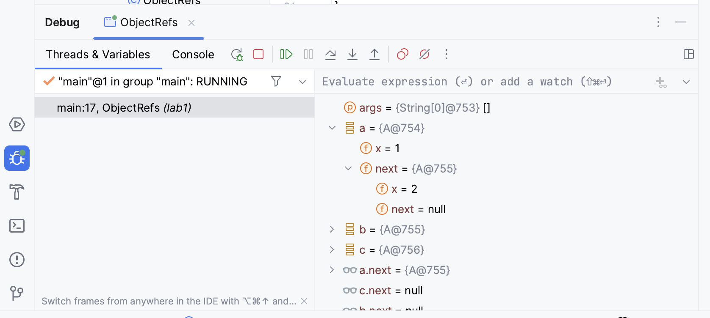
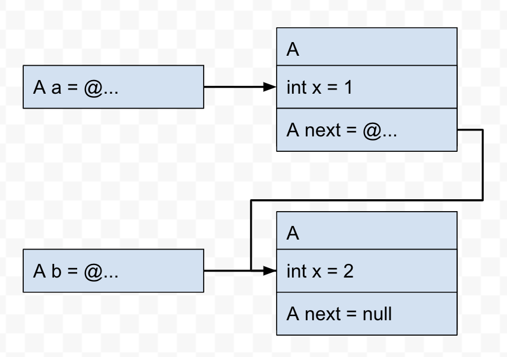
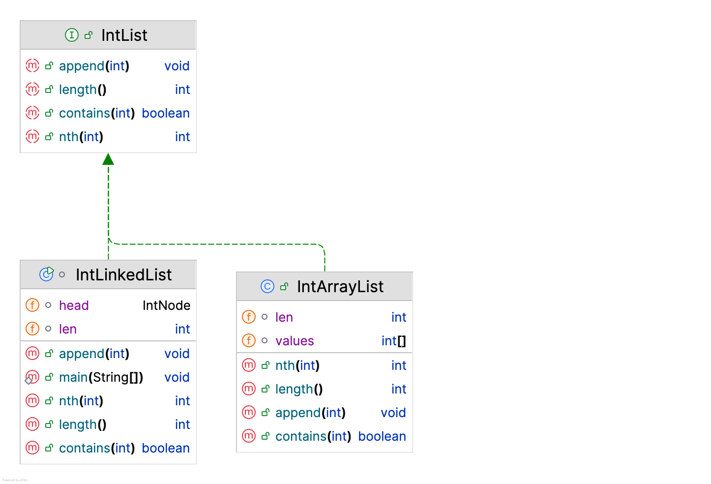

# Further OOP — Lab 1

## References, object diagrams and integer lists

This lab establishes the working pattern for the module: inspect unfamiliar
code, predict what it will do, run it, use tests and the debugger as evidence,
then commit a small working change. Ask for help early if the tools or Java code
do not behave as you expect.

### Learning outcomes

By the end of the lab you should be able to:

- build and test the repository with Gradle and Java 17;
- distinguish an object, a reference variable and a `null` reference;
- draw an object graph that preserves object identity and cycles;
- use an interface through two substitutable implementations; and
- distinguish a behavioural contract from a collection of test examples.

### What is a behavioural contract?

A behavioural contract states what a piece of software promises to do in
terms that callers can observe. It may describe accepted inputs, returned
values, exceptions, changes of state and, where relevant, performance. The
contract says **what** must be true without prescribing **how** it is achieved.

For example, the contract for `HelloWorld.getGreeting()` is simply that it
returns the string `"Hello, World!"`. A test can call the method with one
example and check that promise. The method body is the implementation: it may
change without changing the contract.

A slightly richer example is `IntList.nth(i)`. Its contract says that valid
indexes are zero-based, the returned value is the element at index `i`, and an
invalid index causes `IndexOutOfBoundsException`. An array-backed list and a
linked list can satisfy that same contract with very different code.

A Java interface is useful for declaring operation names and types, but those
types rarely express the whole contract. Tests provide evidence that an
implementation follows the contract, but a finite test suite cannot list every
possible input and state. Throughout the module, treat the written contract as
the requirement and the supplied tests as representative examples of it.

## 1. Repository and test check

Open [`HelloWorld.java`](../../src/main/java/hello/HelloWorld.java) and run its
`main` method. Then open
[`HelloWorldTest.java`](../../src/test/java/hello/HelloWorldTest.java) and run
the test class.

One test initially reports a problem. Read its assertion and compare the
expected value with the value returned by `getGreeting()`. The test describes
the required behaviour, so correct `getGreeting()` rather than weakening or
removing the assertion.

Run the focused test again, then run the complete public suite from a terminal:

```bash
./gradlew test
```

Other exercises are intentionally incomplete, so the complete suite will not
yet be green. Confirm that the Hello World problem has gone away, inspect your
change with `git diff`, and commit and push it. Small, meaningful commits make
it much easier to recover work and understand how your solution developed.

**Checkpoint:** `HelloWorldTest` passes and the change is present in your
private repository.

## 2. References and object graphs

Study [`ObjectRefs.java`](../../src/main/java/hello/ObjectRefs.java) without
running it. Write down the output you predict. In particular, decide whether
`a`, `b` and `c` contain objects themselves or references to objects, and trace
each occurrence of `.next` one step at a time.

Now run the program and compare the output with your prediction. If it differs,
explain the first point at which your mental model and the program disagree.

### Inspecting the graph in the debugger

Set one breakpoint on the statement that closes the cycle (`c.next = a`) and a
second on the first `println`. At the first pause, `c.next` has not yet been
assigned; at the second, it has. Expand the variables and their `next` fields
in the debugger. Repeatedly following `next` after the second pause eventually
returns to an object you have already seen.



This screenshot only illustrates how references can be expanded; its values
depend on where execution is paused. Your IDE may also look different. Values
such as `A@754` are debugger labels, not Java variable names; they help show
when two references identify the same object.

### Drawing an object graph

An object diagram represents one moment during execution. Use a separate box
for every object, and a separate labelled arrow for every non-null reference.
Show primitive field values inside their object. Write `null` explicitly rather
than drawing an arrow to nowhere. Two references to the same object must point
to the same box, and a cycle must visibly return to an existing box.

The following is a small style example from an earlier point in a similar
program. It is not the answer to the three-object exercise.



Draw the state at both debugger pauses. The difference between the diagrams
should be one changed reference and the resulting cycle. Save the completed
diagram as `docs/lab01/ObjectDiagram.png` in your repository (create the
directory if necessary).

**Checkpoint:** another person can trace every variable and field in your
diagram without consulting the source code.

## 3. A small list abstraction

The [`IntList`](../../src/main/java/intlists/IntList.java) interface describes
operations without prescribing how values are stored. The starter supplies two
representations:

- [`IntArrayList`](../../src/main/java/intlists/IntArrayList.java), backed by an
  array; and
- [`IntLinkedList`](../../src/main/java/intlists/IntLinkedList.java), backed by
  linked `IntNode` objects.



Code written against `IntList` can use either implementation. This is why a
shared abstract test class can express the contract once while small concrete
test classes supply the implementation to be tested.

Before changing the classes, inspect their fields and state the representation
invariants you expect. For example, decide what `len` should mean at all times,
what `head == null` implies, and which part of the backing array contains list
elements.

Both implementations must satisfy this contract:

- A new list has length zero.
- `append(v)` adds `v` after every existing element and increases the length by
  one.
- `contains(v)` is true exactly when an element equal to `v` is present.
- `nth(i)` uses zero-based indexing and throws `IndexOutOfBoundsException` when
  `i < 0` or `i >= length()`.
- Duplicate and negative integer values are permitted.
- `equals` compares the complete ordered sequence of values, not object
  identity. Any two `IntList` implementations with the same contents are
  equal; an `IntList` is not equal to an object outside the `IntList`
  abstraction.
- Equal lists return equal `hashCode` values, independent of their backing
  representation.

Complete the `todo` sections in both classes. For this lab, concentrate on
correctness and maintaining the invariants. The supplied array implementation
copies its storage on every append, and a straightforward linked implementation
may traverse the list to append. Those choices are deliberately inefficient;
Lab 2 introduces generic and more efficient versions. Leave
`IntLinkedList.containsCycle()` for Lab 2.

### Tests are examples, not the specification

Read
[`AbstractIntListTest`](../../src/test/java/intlists/AbstractIntListTest.java),
then find the two concrete test classes that extend it. Notice how
`createList()` allows the same tests to exercise two representations.

The supplied tests demonstrate representative behaviour but do not enumerate
every valid input or state. Write at least three additional tests of your own
under `src/studentTest/java`; see the
[`studentTest` instructions](../../src/studentTest/README.md). Choose them from
different behavioural categories rather than making three minor variations of
the same example. Give each test a name that describes the behaviour it checks.

Do not modify a supplied test merely to make an incorrect implementation pass.
A public test suite passing is useful evidence, not proof that the full contract
has been met; assessment also uses held-out cases.

**Checkpoint:** both implementations satisfy the public tests, your own tests
exercise additional behaviour, and you can explain how each representation
changes during `append`. You should also be able to explain why overriding
`equals` without a consistent `hashCode` would violate Java's object contract.

Run your own suite independently with `./gradlew studentTest`.

## Reflection questions

1. Why can the same abstract test class exercise both implementations?
2. What representation invariants should each class maintain?
3. Which operations currently require time proportional to list length?
4. Which parts of this example demonstrate abstraction, encapsulation,
   inheritance and polymorphism?
5. If an application needed only insertion and membership testing, what other
   collection abstraction might be more appropriate than a list?

Commit and push your completed code, tests and object diagram before moving on
to Lab 2.
