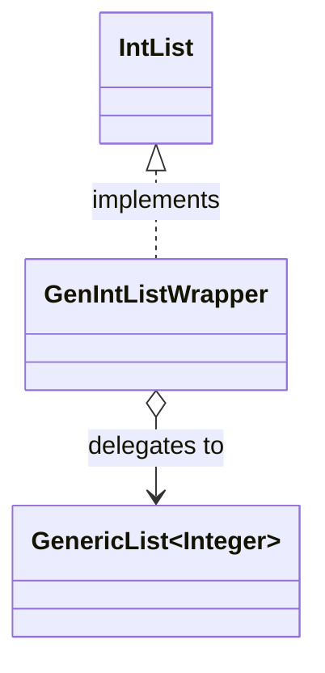
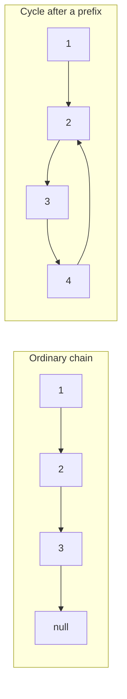

# Further OOP — Lab 2

## Generics, iterators and linked structures

Lab 1 used lists restricted to primitive `int` values. This lab generalises
the same ideas to objects, makes the list implementations more efficient and
introduces Java's iteration and object-equality contracts. It finishes by
contrasting mutable linked nodes with an immutable record chain.

### Learning outcomes

By the end of the lab you should be able to:

- use a type parameter to make one class work safely with many object types;
- supply behaviour to a generic class with a `Comparator<T>`;
- implement an `Iterable<T>` whose iterators have independent state;
- distinguish reference identity from logical and collection equality;
- preserve the `equals`/`hashCode` contract across different representations;
- reason about time and space complexity; and
- detect cycles without changing a linked structure.

## 1. Generic selectors

Study
[`MostRecentObject<T>`](../../src/main/java/stats/MostRecentObject.java). The
type variable `T` stands for one object type selected when an instance is
created:

```java
MostRecentObject<String> recent = new MostRecentObject<>();
recent.add("hello");
String value = recent.getMostRecentObject();
```

The compiler now knows that this instance accepts and returns strings. Try to
assign the returned value to an `Integer` and inspect the compiler message.
Generics move this type error from runtime to compile time without requiring a
separate `MostRecentString`, `MostRecentInteger` and so on.

Next study [`Selector<T>`](../../src/main/java/stats/Selector.java). It does not
know what “best” means; the supplied `Comparator<T>` provides that policy.
Before running its example, predict the selection after each call to `add`.

Complete
[`StringSelectors`](../../src/main/java/stats/StringSelectors.java) so that it
creates selectors for the longest and shortest strings. Comparison is based on
string length. When lengths tie, retaining the first value is acceptable, but
the policy must be consistent. An empty selector returns `null`.

**Checkpoint:** explain why `Selector<String>` can implement both operations
without containing string-specific comparison code.

## 2. Half-open ranges and the iterator contract

An `Iterable<T>` creates an `Iterator<T>`. The iterable stores the description
of a sequence; each iterator stores its own current position within that
sequence. Study the complete [`Range`](../../src/main/java/iterators/Range.java)
before implementing `OddRange` and `FibonacciRange`.

`Range(-1, 2)` is half-open: it includes the start and excludes the end.

| Operation | Result | Iterator position afterwards |
|---|---:|---:|
| `hasNext()` | `true` | `-1` |
| `next()` | `-1` | `0` |
| `hasNext()` twice | `true`, `true` | `0` |
| `next()` | `0` | `1` |
| `next()` | `1` | `2` |
| `hasNext()` | `false` | `2` |

Complete [`OddRange`](../../src/main/java/iterators/OddRange.java) and
[`FibonacciRange`](../../src/main/java/iterators/FibonacciRange.java). All
range classes use an inclusive start and exclusive end. A backwards or empty
range produces no values.

Every iterator must obey these rules:

- Repeated `hasNext()` calls do not advance it.
- `next()` advances by exactly one value.
- `next()` throws `NoSuchElementException` after exhaustion.
- Calling `iterator()` twice creates independent iteration state.

Account for negative bounds and integer overflow rather than relying only on
the supplied examples. Write down a short trace before coding any case that is
difficult to reason about.

**Checkpoint:** create two iterators from one range, advance them by different
amounts and explain why neither changes the other.

## 3. Efficient generic lists

Complete
[`GenericArrayList<T>`](../../src/main/java/genlists/GenericArrayList.java) and
[`GenericLinkedList<T>`](../../src/main/java/genlists/GenericLinkedList.java).
They implement [`GenericList<T>`](../../src/main/java/genlists/GenericList.java)
and must preserve the Lab 1 list behaviour while accepting any object type.

The additional requirements are:

- `GenericArrayList.append` takes amortized O(1) time by retaining spare
  capacity and occasionally growing the backing array.
- `GenericLinkedList.append` takes O(1) time; its representation therefore
  needs enough information to find the insertion point without traversal.
- `contains` uses logical equality rather than `==`. Use `Objects.equals` so
  equal but distinct objects match and `null` has a consistent meaning.
- `nth` follows the Lab 1 bounds contract.
- Iteration returns elements in append order and obeys the iterator contract.

Before implementing the operations, write down conditions that must always be
true about each object's fields. These are its **representation invariants**.
For example:

- In the array list, `0 <= len && len <= values.length`, and the logical list
  elements occupy exactly the indexes `i` for which `0 <= i && i < len`. The
  remaining array positions are spare capacity rather than list elements.
- If the linked list has `head` and `tail` references, an empty list has both
  set to `null`. In a non-empty list, `tail` identifies the final reachable
  node and `tail.next` is `null`.

Complete each set of invariants yourself. In particular, describe the
relationship between `len` and the number of logical elements or reachable
nodes, and state what must remain true about element order after an append.
Write these as brief comments or notes, then check every operation against
them, including its empty-list case.

This is a formative design exercise, not a separately auto-marked written
deliverable. AutoGrader assesses the observable behaviour and complexity that
should result from preserving the invariants. You should also be prepared to
state an invariant, identify where your code preserves it and explain the
effect of breaking it during a lab discussion or mini-viva.

### Reusing the integer-list contract

[`GenIntListWrapper`](../../src/main/java/intlists/GenIntListWrapper.java)
adapts a `GenericList<Integer>` to the older `IntList` interface. This allows
the same contract tests to exercise both the original and generic
implementations.



This is an example of composition and delegation: the wrapper translates one
abstraction into another without inheriting either list representation.

## 4. Equality of lists and their elements

Reference identity asks whether two variables identify the same object.
Logical equality asks whether two objects represent the same value. For
example, two separately created strings can be logically equal even though
`a == b` is false. Consequently, every generic-list implementation must use
logical equality when searching its elements.

The list objects themselves also have value semantics:

- Two `IntList` objects are equal when they contain the same integers in the
  same order, regardless of their `IntList` implementation.
- Two `GenericList` objects are equal when they have the same length and each
  corresponding pair of elements is equal according to `Objects.equals`,
  regardless of their `GenericList` implementation.
- Equality is confined to the abstraction. An `IntList` is never equal to a
  `GenericList<Integer>` directly. A `GenIntListWrapper` participates as an
  `IntList`, providing an explicit bridge between the abstractions.

Implement `equals(Object)` for every list class. It must be reflexive,
symmetric, transitive and consistent, and must return false rather than throw
when given an unrelated object. Do not compare backing arrays, node objects or
capacities: those are representation details.

Whenever `equals` is overridden, `hashCode` must also be overridden. Equal
lists must return the same order-sensitive hash even when their internal
representations differ. This is required for reliable use in hash-based Java
collections.

The supplied equality tests demonstrate one ordinary cross-representation
case. Add your own tests under `src/studentTest/java`, following the
[`studentTest` instructions](../../src/studentTest/README.md), and base them on
the contract rather than duplicating that example. Assessment includes
additional values and states.

**Checkpoint:** explain why identity-based element comparison can appear to
work with some small integers or string literals and then fail with separately
constructed but equal objects.

## 5. Cycle detection

Implement `containsCycle()` in both mutable linked-list classes. The method
must detect self-loops and cycles beginning anywhere in a list, terminate on
cyclic input, leave the structure unchanged, run in O(n) time and use O(1)
additional space.



The diagrams specify structures the method must recognise; they do not prescribe
an algorithm. A collection of visited nodes would make detection easier, but it
would violate the additional-space requirement. Do not break links temporarily
or otherwise mutate the list.

## 6. Immutable record list

Finally, repair
[`GenericLinkedListRecord`](../../src/main/java/genlists/GenericLinkedListRecord.java).
Its node record is immutable: an existing node's `next` component cannot be
changed. Appending therefore requires constructing a new path while preserving
the previous values and order.

Trace an append to a three-element chain on paper. Mark which record objects
can be reused and which must be copied. Compare its append complexity with the
mutable linked list, and consider what immutability gains in return. A normally
constructed record chain cannot contain a cycle because a node cannot later be
redirected to an existing node.

The record-based list must satisfy the same `GenericList` equality and hash
contract as the array-backed and mutable linked implementations.

## Reflection questions

1. Why is `Objects.equals(a, b)` safer than calling `a.equals(b)` directly?
2. Why must equality be symmetric across array and linked representations?
3. What is the amortized cost of array append, and why is an individual append
   not guaranteed to be O(1)?
4. Why does each call to `iterator()` need a new iterator object?
5. What design trade-off does the immutable record list make?
6. Why is `hashCode` part of the equality exercise even though a list can work
   without being placed in a `HashSet` or used as a `HashMap` key?

Run the relevant public tests and run your own suite with
`./gradlew studentTest`, then commit and push the completed work.
