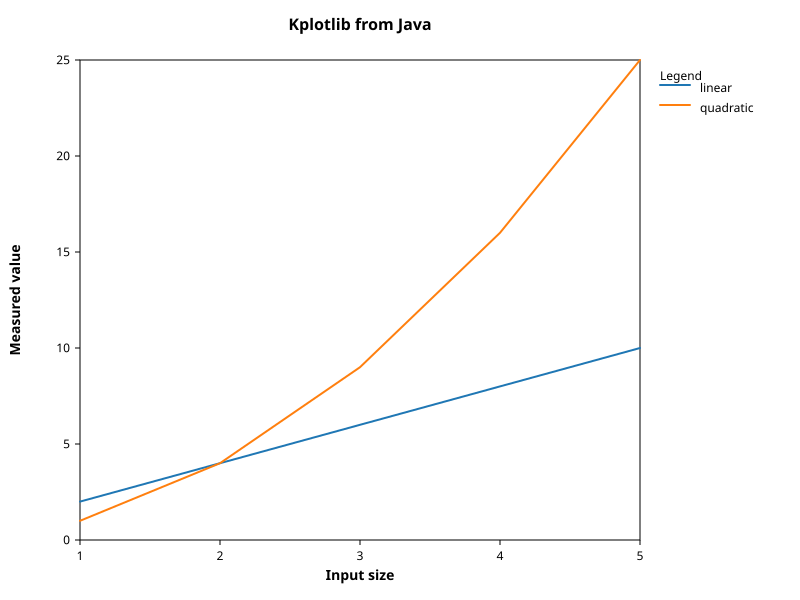
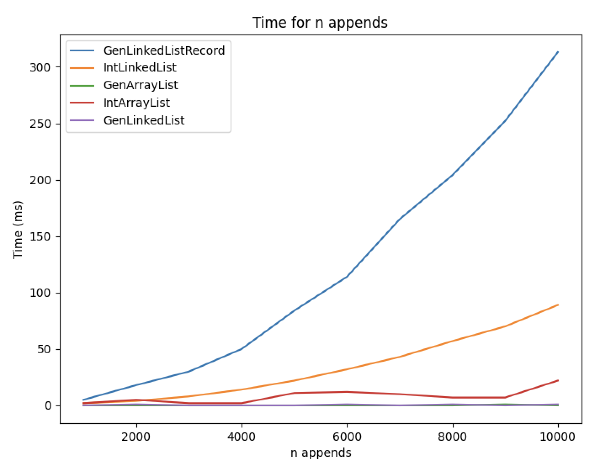

# Further OOP — Lab 3

## Performance, running statistics and Kplotlib

Performance experiments look objective because they produce numbers, but it is
easy to measure the wrong quantity or draw a conclusion from noise. This lab
develops a small experiment in stages, compares the list implementations from
Labs 1 and 2, plots the results in Java, and builds a statistics class suitable
for summarising repeated trials.

### Learning outcomes

By the end of the lab you should be able to:

- explain why one timing of one fast operation is unreliable;
- design a configurable and repeatable comparative experiment;
- distinguish total time, time per operation and operation cost at a given
  structure size;
- summarise variation rather than reporting only a best run;
- generate a labelled, headless plot using Kplotlib; and
- implement numerically stable running mean and sample standard deviation.

Record predictions, settings, results and short explanations in
[`docs/lab03/lab_notes_template.md`](../../docs/lab03/lab_notes_template.md).
The notes are formative working material rather than a separately marked
report, but selected evidence may be useful in later coursework and its
mini-viva.

## 1. Why a single timing is misleading

Open
[`ArithmeticSpeedTest`](../../src/main/java/performance/ArithmeticSpeedTest.java).
Before running it, estimate the time required for one integer increment. Run it
several times and record the elapsed nanoseconds.

The measured interval includes more than `x++`: calls to the clock, execution
by the JVM and operating-system scheduling all contribute. The operation may
also be faster than the useful resolution of the measurement. Variation
between runs is therefore expected and may be larger than the quantity of
interest.

Now study
[`ArithmeticSpeedTestAverage`](../../src/main/java/performance/ArithmeticSpeedTestAverage.java).
It performs many operations inside one timed interval. Run it repeatedly, then
change one factor at a time:

1. Reduce the repetition count by successive factors of ten.
2. Replace the increment with an empty loop body.
3. Compare the increment with the supplied random-number operation.

Predict the effect before each change, record what happens, then restore the
baseline. Retaining and printing `x` makes the computed result observable, but
does not by itself make this a rigorous benchmark.

### Sources of variation

Java performance measurements can be affected by timer resolution, JVM
warm-up, just-in-time compilation, garbage collection, dead-code elimination,
CPU frequency changes and activity elsewhere on the machine. `System.nanoTime()`
is appropriate for elapsed time, but a precise clock does not repair a poor
experimental design.

For this module:

- include untimed warm-up work before collecting results;
- time enough work to obtain a meaningful interval;
- run multiple independent trials;
- keep an observable result so the work cannot simply disappear;
- change one experimental factor at a time; and
- report a summary and variation, not just the fastest observation.

**Checkpoint:** explain why dividing one noisy duration by a very large loop
count can produce an apparently precise but misleading time per operation.

## 2. List-append experiment

You will compare these five implementations:

1. `IntArrayList`
2. `IntLinkedList`
3. `GenericArrayList<Integer>` through `GenIntListWrapper`
4. `GenericLinkedList<Integer>` through `GenIntListWrapper`
5. `GenericLinkedListRecord<Integer>` through `GenIntListWrapper`

First predict the shape of each timing series from its append algorithm. Do not
change a prediction merely because the measurements later disagree; explain
the disagreement instead.

[`SingleListAppendEval`](../../src/main/java/performance/SingleListAppendEval.java)
shows the smallest useful starting point, while
[`EvalIntListSpeed`](../../src/main/java/performance/EvalIntListSpeed.java)
shows how factories can configure multiple implementations without duplicating
the timing logic. Adapt or replace these examples to create one experiment in
which the following settings each have one clear place to change:

- included list implementations;
- input sizes;
- warm-up count;
- measured trial count; and
- the statistic reported for each point.

For each trial, create a fresh list and time `n` appends. This measures the
total cost of constructing a list of length `n`; it does **not** measure one
append to an already constructed list of size `n`. During construction the
list sizes range from zero to almost `n`, so the average size is approximately
`n / 2`.

Check the completed list's length, or otherwise consume a result, so the work
remains observable. Keep correctness checks outside the timed interval: the
experiment should measure appends rather than its own validation code.

Choose input sizes that finish in a practical time. An inefficient
implementation may require a smaller maximum size during development. Do not
silently omit it from the final comparison: record any adjusted range and
explain why it was needed. Store raw trial results as well as the summary used
for plotting.

**Checkpoint:** another student can change the implementations, sizes and
trial count without editing the timing loop itself, and can reproduce your
experiment from your notes.

## 3. Plotting with Kplotlib

All plots for this module must be generated from Java using Kplotlib. Run the
headless example with:

```bash
./gradlew run -PmainClass=performance.KplotlibExample
```

[`KplotlibExample`](../../src/main/java/performance/KplotlibExample.java)
creates `build/plots/kplotlib-example.svg`. It constructs a `Plot`, supplies a
title and axis labels, adds named series and saves the result without opening a
desktop window.



Use the same workflow for your list experiment. Your plot must:

- identify every series;
- label both axes, including units;
- state clearly what one data point measures;
- show uncertainty when it materially affects interpretation; and
- be saved as SVG or PNG by code that can regenerate it.

Do not call `show()` in code intended for automated assessment. A saved plot is
portable, works in headless CI and records the exact output used in your work.

### A graph can be accurate but uninformative

The following older example places implementations with very different times
on one linear scale. The slow series dominates the vertical range, making
differences between the faster series almost invisible.



Do not simply remove inconvenient series. Consider a justified logarithmic
scale, a second focused panel or separate plots with an explicit explanation.
Choose the presentation that answers your experimental question without
hiding data.

## 4. Running statistical summaries

Study [`StatSummary`](../../src/main/java/stats/StatSummary.java) and the
complete
[`ListBasedSummary`](../../src/main/java/stats/ListBasedSummary.java). The
list-based version retains every observation, which makes its implementation
easy to understand but causes several queries to revisit all stored values.

Complete [`RunningSummary`](../../src/main/java/stats/RunningSummary.java) so
that it retains only a fixed amount of summary state:

- adding one value is O(1);
- `n()`, `sum()`, `mean()` and `standardDeviation()` are O(1); and
- adding a collection of `k` values is O(k), with O(1) work per value.

`mean()` requires at least one value. Sample standard deviation requires at
least two values and uses a denominator of `n - 1`. When insufficient data is
available, throw `NotEnoughDataException`, as `ListBasedSummary` does.

A tempting variance calculation stores a running sum of values and squares,
then subtracts two large, nearly equal quantities. That can lose substantial
floating-point precision for large values with small differences. Use a
numerically stable online algorithm instead. Held-out evaluation includes data
for which the naïve sum-of-squares formula is inaccurate.

Use `RunningSummary` to summarise repeated list timings. Decide whether mean
and sample standard deviation answer your experimental question, and mention
outliers or skew if they make that summary misleading.

## Required stopping point

The core work for this lab is complete when you have:

- recorded the short arithmetic-timing observations;
- implemented one configurable experiment covering all five list types;
- retained raw results from repeated trials;
- generated one clear Kplotlib plot with labelled axes and named series;
- completed `RunningSummary`; and
- recorded enough settings for another person to reproduce the experiment.

Polishing additional plots or building a general benchmarking framework can be
useful, but it is optional. Concentrate first on a defensible experiment and a
clear explanation of what was measured.

## Reflection questions

1. Which sources of timing variation can repeated trials reduce, and which
   systematic errors remain?
2. Why is timing `n` appends to a fresh list different from timing one append
   to a list already containing `n` elements?
3. What plot design best exposes differences among the faster implementations
   without concealing the slower ones?
4. What information does `ListBasedSummary` retain that `RunningSummary`
   deliberately discards?
5. When might median and percentiles be more informative than mean and standard
   deviation?

Commit and push the experiment code, `RunningSummary`, plot and updated notes
before moving on to Lab 4.
