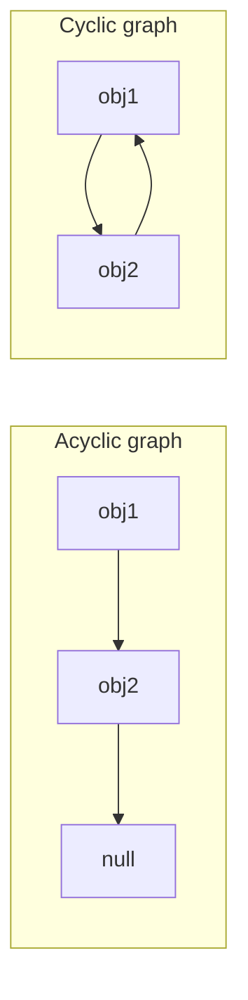
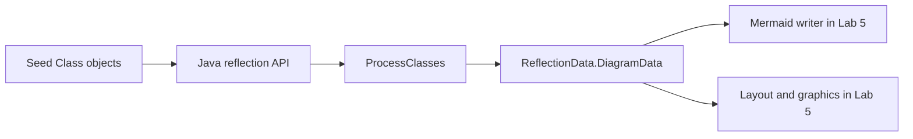

# Further OOP — Lab 4

## Serialization and reflection

This lab starts with object serialization: converting Java objects to a form
that can be stored or exchanged. It then uses Java reflection to inspect class
declarations and convert them into a small, standalone model. Lab 5 will use
that model to generate text and graphical UML output.

### Learning outcomes

By the end of the lab you should be able to:

- serialize and deserialize ordinary classes and records with Gson;
- explain why a cyclic object graph cannot be represented by ordinary nested
  JSON without an additional policy;
- inspect declared fields, constructors and methods using reflection;
- distinguish `Class<?>` from the more general `Type` abstraction;
- convert reflection objects into immutable, language-neutral records;
- identify inheritance, implementation and signature dependencies; and
- traverse a dependency graph without repeatedly processing the same class.

## 1. JSON and Gson

JSON represents objects using names and values. For example, part of a Java
person object might be serialized as:

```json
{
  "firstNames": "Simon",
  "lastName": "Lucas",
  "personId": 12345,
  "isCurrent": true
}
```

Serialization converts an object into this textual representation.
Deserialization constructs an object from the text. A **round trip** performs
both operations and checks that the reconstructed object has the same relevant
values as the original.

Study and run
[`HelloGson`](../../src/main/java/reflection/gson/HelloGson.java). Its
`toJsonString` method is complete, but `fromJsonString` is not. Use the Gson API
to deserialize the supplied JSON into `PersonClass`; do not parse individual
fields by hand. Run the example and the focused public tests.

Repeat the exercise for
[`HelloGsonRecord`](../../src/main/java/reflection/gson/HelloGsonRecord.java).
Modern Gson versions support Java records directly. Notice that the record
already has value-based `equals`, making the round-trip comparison more concise
than it is for `PersonClass`.

**Checkpoint:** explain the difference between checking that two references
identify the same object and checking that serialization preserved an object's
values.

## 2. Cyclic object graphs

JSON naturally forms a tree: each nested object is written inside its parent.
Java object structures are graphs and can contain cycles.



Naively following `ref` in the second graph revisits `obj1`, then `obj2`, and
so on. Gson cannot encode that identity-preserving cycle as ordinary nested
JSON and will eventually exhaust the call stack.

Complete
[`CyclicGsonExample.serializeObject`](../../src/main/java/reflection/gson/CyclicGsonExample.java)
with this observable contract:

- An acyclic `MyObject` chain is serialized normally.
- If following references encounters a cycle, throw `CyclicGraphException`
  before asking Gson to recurse indefinitely.
- The input graph is not modified.

Rejecting cycles is one possible serialization policy. Alternatives include
replacing references with identifiers, omitting selected back-references or
using a format that explicitly represents object identity. Briefly compare two
policies, but implement the rejection policy required by this exercise.

**Checkpoint:** draw the references visited for the acyclic and cyclic examples
and identify the exact point at which the latter must be rejected.

## 3. From reflection to a standalone model

Java represents a loaded type with `Class<?>`. From it, reflection provides
objects such as `Field`, `Constructor<?>` and `Method`. These are useful for
inspection, but they are tied to Java's reflection API and are awkward input
for unrelated layout and rendering code.

Run
[`PrintClassDetails`](../../src/main/java/reflection/uml/PrintClassDetails.java)
and inspect its use of:

- `getDeclaredFields()`;
- `getDeclaredConstructors()`;
- `getDeclaredMethods()`; and
- generic parameter and return types.

“Declared” means members introduced by that class, rather than every inherited
member. Before running it on a second class, predict which fields and methods
will appear.

The course separates reflection from later output stages:



[`ReflectionData`](../../src/main/java/reflection/uml/ReflectionData.java)
defines immutable records for this intermediate model:

- `ClassData` stores identity, display name, kind and members.
- `FieldData` stores a field's name, type, visibility and static status.
- `CallableData` represents constructors and methods, including parameters,
  return type, visibility and relevant modifiers.
- `Link` represents `EXTENDS`, `IMPLEMENTS` or `DEPENDENCY`.
- `DiagramData` contains the complete collection of classes and links.

This separation has two benefits. Reflection can change without changing the
renderers, and another language could produce the same `DiagramData` without
using Java reflection at all.

## 4. Extracting class data

Complete
[`ProcessClasses`](../../src/main/java/reflection/uml/ProcessClasses.java) in
small stages. Run focused tests after each stage rather than attempting the
whole class at once.

### Stage A: class kind

Implement `getClassType` so it distinguishes ordinary classes, abstract
classes, interfaces, enums and records. Some reflection predicates overlap—for
example, an interface is also abstract—so use an order that returns the most
specific required category.

### Stage B: fields and callables

The field extraction provides a worked example. Complete constructor and method
extraction using declared members and their generic types. Preserve:

- names and parameter order;
- method return types;
- `PUBLIC`, `PROTECTED`, `PRIVATE` or package visibility;
- static status; and
- abstract status where applicable.

The helper methods `visibility` and `typeName` centralise decisions that should
be consistent across fields, constructors and methods.

**Checkpoint:** inspect one resulting `ClassData` value and account for every
component by pointing to the corresponding source declaration.

## 5. Types and dependencies

A simple field such as `Connector connector` has a `Class<?>` type. Generic
signatures can instead produce `ParameterizedType`, `WildcardType`,
`TypeVariable` or `GenericArrayType`. For example:

```java
Map<String, List<? extends Connector[]>> connections
```

contains several nested types even though reflection presents the whole field
as one `Type` value. Study
[`TypeWalker`](../../src/main/java/reflection/uml/TypeWalker.java), which
recursively extracts every concrete `Class<?>` nested inside those forms.

Implement the link methods in `ProcessClasses`:

- `EXTENDS` connects a class to its relevant superclass.
- `IMPLEMENTS` connects a class to each relevant interface.
- `DEPENDENCY` records relevant types used by fields, constructor parameters,
  method parameters or method return values.

Only create a link when both endpoints belong to the diagram. Standard-library
types may remain visible in member signatures, but classes in packages such as
`java.*` and `javax.*` should not be recursively added as diagram nodes.
Primitive and `void` types are also signature information rather than diagram
nodes.

Use fully qualified class names as link endpoints and identities. Two unrelated
classes can both be called `Node`; merging them because their simple names
match silently corrupts the diagram. Simple names remain suitable for display.

Reflection describes declarations, not the statements inside method bodies. A
type used only for a local variable or created only inside a method therefore
cannot be discovered by this pipeline. Analysing those dependencies would
require source-code or bytecode analysis and is outside this lab's contract.

## 6. Recursive discovery without looping

`process` begins with seed classes, but dependencies may lead to further course
classes that were not explicitly supplied. Those classes can lead to still
more classes, and the dependency graph may contain cycles.

Complete the work-list traversal so that it:

1. begins with all seed classes;
2. discovers relevant non-JDK classes from inheritance and member signatures;
3. schedules each newly discovered class for processing;
4. processes every included class at most once; and
5. terminates even when dependencies lead back to an earlier class.

Keep “included or scheduled” state separate in your reasoning from “already
processed” state. A queue or stack controls outstanding work; a set provides
the identity-based memory needed to prevent repeated processing.

Add student-written tests under `src/studentTest/java` for at least:

- a dependency nested in a parameter or return type; and
- two course classes whose dependencies form a cycle.

Follow the [`studentTest` instructions](../../src/studentTest/README.md). Test
properties of `DiagramData` rather than depending on incidental collection
iteration order.

## Required stopping point

The core Lab 4 work is complete when:

- both ordinary-class and record Gson round trips work;
- cyclic `MyObject` graphs are rejected without damaging acyclic behaviour;
- `ProcessClasses` extracts every required class kind and declared member;
- inheritance, implementation and signature dependencies are distinguished;
- nested generic types are handled through `TypeWalker`;
- recursive discovery terminates and retains qualified identity; and
- your two additional dependency tests pass.

Do not implement Mermaid syntax, box layout or Swing rendering in this lab;
those are separate Lab 5 concerns.

## Reflection questions

1. Why is a record easier to compare after a serialization round trip than the
   supplied ordinary `PersonClass`?
2. What information is lost if `Class.getSimpleName()` is used as identity?
3. Why is `Type` needed in addition to `Class<?>`?
4. Which dependencies cannot be discovered from reflection of declarations
   alone?
5. How does the work-list traversal resemble cycle detection in linked lists?
6. What would have to change to support a language other than Java while
   retaining the Lab 5 writers and renderers?

Run the focused public tests and `./gradlew studentTest`, then commit and push
your completed Lab 4 work.
