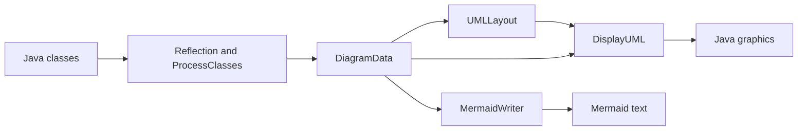
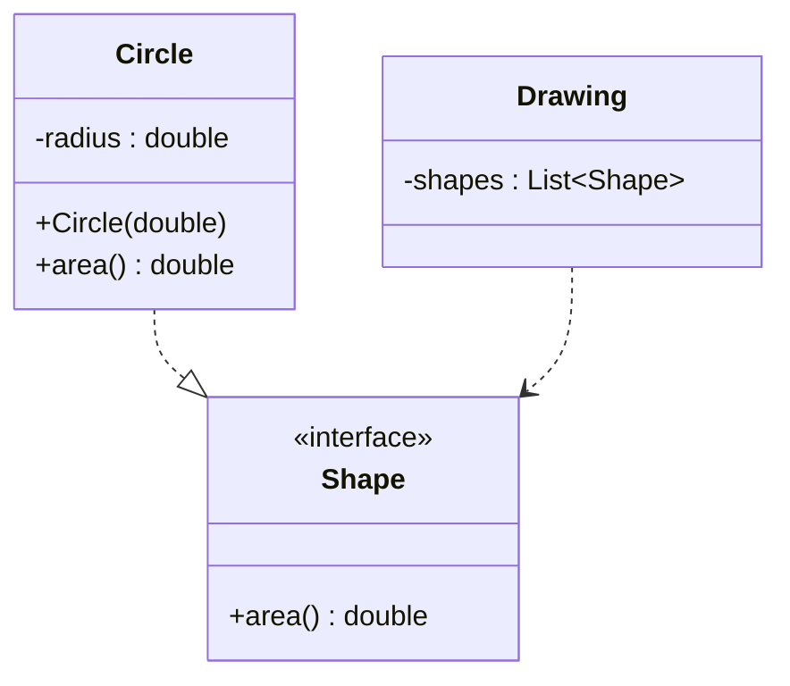
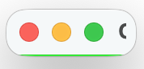
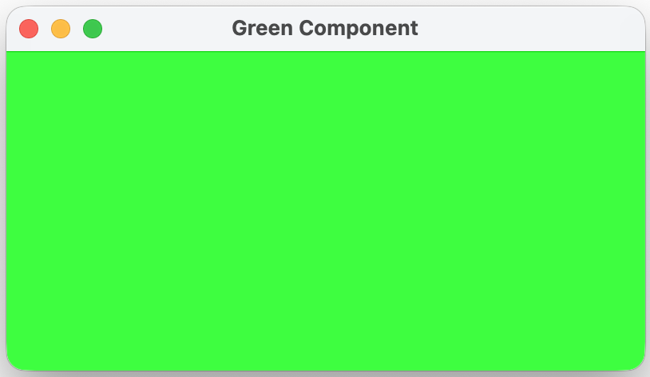
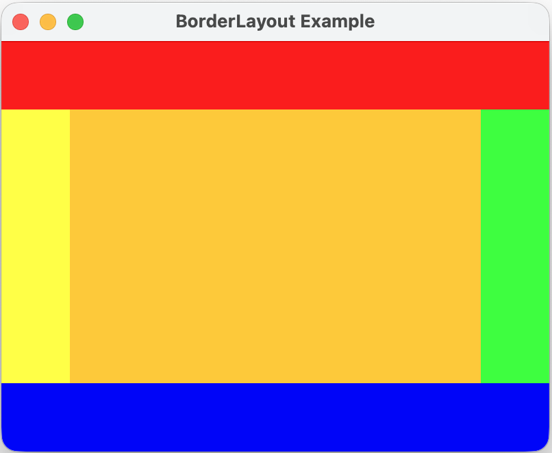
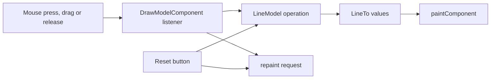
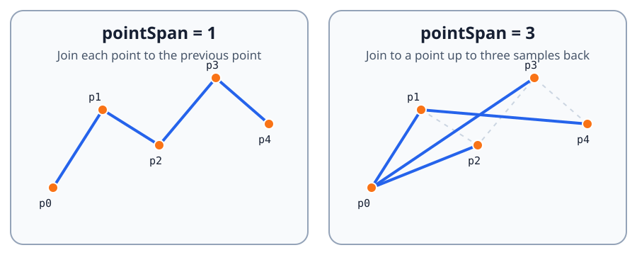
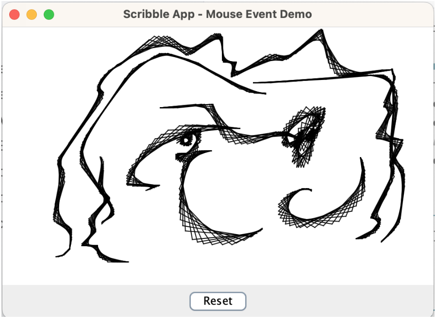

# Further OOP — Lab 5

## UML output, layout and Java graphics

Lab 4 converted Java reflection objects into `DiagramData`. This lab consumes
that model in two different ways: first as Mermaid text and then as a graphical
class diagram. A short Swing exercise introduces the drawing, layout and event
handling ideas needed for the graphical version.

Keep these responsibilities separate:



`ProcessClasses` discovers facts about the program, `UMLLayout` chooses
positions and `DisplayUML` draws them. Changing the layout algorithm should not
require changing reflection, and changing the renderer should not require
changing how positions were calculated.

### Learning outcomes

By the end of the lab you should be able to:

- generate structured text from an immutable object model;
- state and test useful properties of a deterministic layout;
- explain how preferred sizes and layout managers cooperate in Swing;
- separate testable application state from a graphical view;
- handle mouse and button events on Swing's Event Dispatch Thread; and
- render a model without testing fragile, platform-dependent pixels.

## 1. Generate Mermaid class diagrams

Study
[`MermaidWriter`](../../src/main/java/reflection/uml/MermaidWriter.java). It is
a working starting point rather than an unfinished skeleton, but you should
not assume that every formatting decision is correct. Compare its output with
the [Mermaid class-diagram syntax](https://mermaid.js.org/syntax/classDiagram),
then run it on the `DiagramData` produced in Lab 4. Paste the result into a
Mermaid previewer, or into a Markdown file that supports Mermaid.

The writer must preserve the meaning of the model:

- class labels use display names, while internal identifiers remain unique for
  fully qualified names;
- interfaces, abstract classes, enums and records can be distinguished from
  ordinary classes;
- fields, constructors and methods include their UML visibility symbol;
- static and abstract members use Mermaid's supported classifier notation;
- callable parameter types and method return types are included; and
- syntax-sensitive text, including generic types, is translated or escaped so
  that it does not break the diagram; and
- extension, interface implementation and dependency use different arrows.

For example, a small model might produce a diagram like this:



Read the generated text as well as looking at its rendered result. If the text
does not retain enough information to distinguish two same-named classes from
different packages, improve the writer without weakening `DiagramData`'s
qualified identity.

Add student-written tests under `src/studentTest/java` for two meaningful
output properties. Prefer focused assertions such as “a private static field
has both markers” or “implementation and dependency use different arrows”. A
single assertion containing the complete expected document is brittle: a
harmless change in whitespace or ordering can hide which property failed.

**Checkpoint:** explain why a display label and an internal diagram identifier
serve different purposes.

## 2. Lay out the diagram

[`UMLLayout`](../../src/main/java/reflection/uml/UMLLayout.java) converts a
`DiagramData` value into one `ClassLayout` rectangle per class. Coordinates
refer to the centre of a box; its width and height describe the full box. The
renderer should use these values rather than independently deciding where
classes belong.

Study the supplied hierarchy ordering and depth calculation before changing
them. `EXTENDS` and `IMPLEMENTS` links affect vertical hierarchy: a parent
class or interface should appear above its children. A `DEPENDENCY` link does
not make one type the parent of another.

Improve the modest starting layout. For the diagrams used in this module it
should satisfy these observable properties:

- every class has exactly one rectangle, addressed by qualified name;
- boxes have positive dimensions large enough for their member compartments;
- hierarchy parents are above their subclasses or implementations;
- boxes do not overlap; and
- equal input produces equal output, including after repeated runs.

Reducing unnecessary connector crossings in simple diagrams is a design goal,
but there is rarely one uniquely correct arrangement. Judge that aspect by
inspecting several examples rather than writing a test that assumes one exact
set of coordinates.

Determinism matters for debugging, testing and reproducible exported images.
Do not depend on unspecified `HashMap` or `HashSet` iteration order. When
several placements are equally valid, use an explicit and documented
tie-breaker such as qualified-name order.

This is a bounded layout exercise, not a request for a perfect general-purpose
graph drawing algorithm. You may replace the supplied algorithm, but keep the
boundary between layout and rendering. Test rectangle geometry and relative
positions directly; do not take screenshots and compare pixels.

**Checkpoint:** construct a tiny hierarchy with one interface and two
implementations. State which aspects of its layout are required and which are
merely aesthetic choices.

## 3. Components, preferred size and layout managers

Run [`GreenComponent`](../../src/main/java/graphics/GreenComponent.java). Its
painting method fills the space assigned to the component. It does not choose
that space. The component supplies a preferred-size hint, the frame's layout
manager uses that hint, and `pack()` sizes the window around the result.

Without a useful preferred size, the packed component can appear to vanish:



With the hint used by the supplied class, the same drawing code has room to
paint:



Next run
[`BorderLayoutExample`](../../src/main/java/graphics/BorderLayoutExample.java).
Resize its window and observe which dimensions of the north, south, east and
west components are respected, and which remaining space is given to the
centre.



Experiment temporarily with one preferred size and predict the result before
running it. Restore the supplied values afterwards. The important lesson is
that components express sizing preferences while a container's layout manager
negotiates their actual bounds.

Both examples create their interface inside `SwingUtilities.invokeLater`.
Swing event handling and component changes normally take place on the **Event
Dispatch Thread** (EDT). Keeping that rule makes event ordering predictable
and avoids intermittent user-interface faults.

## 4. A model-backed Scribble application

Open
[`ScribbleModelApp`](../../src/main/java/graphics/ScribbleModelApp.java). The
unfinished application deliberately separates the drawing state from the
Swing component. `LineModel` must work in a unit test without opening a window;
`DrawModelComponent` translates user input into model operations and renders
the resulting `LineTo` values.



Complete `LineModel` to the following contract:

- `startNewLine(point)` begins a new stroke whose first sampled point is
  `point`.
- `addPoint(point)` appends to the active stroke. If no stroke is active, it
  begins one at `point`.
- `closeLine(point)` appends the final point and ends the active stroke. With
  no active stroke it has no effect.
- `reset()` removes all strokes and leaves no stroke active.
- `getLines()` derives drawable segments without exposing mutable internal
  point collections.

The model intentionally does not always join consecutive samples. For a
stroke containing `p0, p1, ...`, the segment ending at `pi` begins at:

```text
p[max(0, i - pointSpan)]
```

Therefore `pointSpan = 1` gives an ordinary polyline. A larger value draws
longer, overlapping chords and produces the layered effect seen below.



Implement the component events so that pressing starts a stroke, dragging
adds points, releasing closes the stroke and Reset clears the model. Each
state-changing event must request repainting. In `paintComponent`, call the
superclass implementation first, enable antialiasing and draw every segment
provided by the model.

Finally, create the Scribble window on the EDT and remove any console-only
demonstration code left in `main`. A completed application can produce this
kind of layered drawing:



The supplied tests are representative, not exhaustive. Add focused tests for
two behaviours that the public examples do not already demonstrate. Derive
them from the contract above rather than copying a long list of anticipated
edge cases.

**Checkpoint:** explain why `LineModel` contains no `JFrame`, mouse listener or
`Graphics2D`, and how that makes its behaviour easier to test.

## 5. Render the UML model with Java graphics

[`DisplayUML`](../../src/main/java/reflection/uml/DisplayUML.java) currently
draws only a simple class name inside each rectangle. Extend it to consume both
the `DiagramData` from Lab 4 and the positions from `UMLLayout`. You may change
its constructor and supporting interfaces: the existing layout-only API is
too restrictive for drawing members and relationships.

The graphical result should show:

- a class header and separate field and callable compartments;
- the relevant member text, including visibility and static status;
- visually distinct extension, implementation and dependency connectors;
- appropriate arrowheads; and
- all boxes at the coordinates supplied by the layout.

Draw connectors before boxes so that a line ending at a class does not obscure
its text. Clip or calculate connector endpoints at box boundaries rather than
always drawing from centre to centre. Keep formatting helpers small: converting
visibility to a symbol, formatting a callable and drawing an arrowhead are
different responsibilities.

Update the demonstration so that it uses genuine `DiagramData`, creates its
window on the EDT and closes cleanly. Also support rendering to a
`BufferedImage` and write one PNG example. Off-screen rendering makes export
possible without requiring the image itself to be the source of truth in unit
tests.

Test stable properties below the pixel level—for example formatted labels,
the presence of every rectangle, connector kinds and calculated endpoints.
Exact pixels, fonts and antialiasing differ across operating systems and
should not determine whether the implementation is correct.

## Required stopping point

The core Lab 5 work is complete when:

- Mermaid output preserves class identity, members and all three link kinds;
- the layout is deterministic, non-overlapping and respects hierarchy;
- the Scribble model and event handling satisfy the documented contract;
- Swing windows are constructed on the EDT and close cleanly;
- `DisplayUML` renders compartments and distinct relationship connectors from
  `DiagramData` plus `UMLLayout`;
- a UML diagram can be exported to PNG; and
- the requested student-written tests pass with the supplied tests.

Run the focused public tests and `./gradlew studentTest`, then commit and push
your completed Lab 5 work.

## Reflection questions

1. Why should `MermaidWriter` not inspect Java classes directly?
2. Which layout properties can be tested without rendering an image?
3. Why can two correct renderings have different pixels?
4. What visual behaviour does `pointSpan` produce, and why?
5. What responsibilities belong to the Scribble model rather than its Swing
   component?
6. Why does `DisplayUML` need both `DiagramData` and the layout map?
