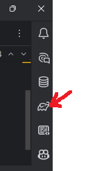
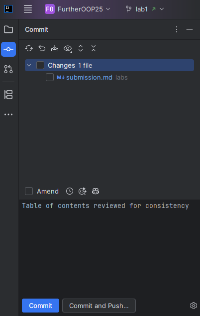
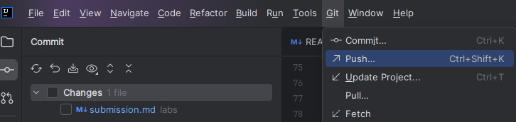

# Submission Guidelines for Further OOP 2026

Welcome to the **Further OOP** coursework repository.  
Please follow these instructions carefully when working with your private repo.  
This ensures your work can be built, tested, and assessed correctly.

---

## 🚀 Workflow

1. **Set up your repo**

(you may have already done this in the Getting Started section, in which case skip to next section)

  - Clone the public starter repository, create an empty **private** repository
    on QMUL GitHub, and configure it as `origin`, following the
    [Getting Started instructions](getting-started/README.md). This is essential:
    otherwise others could copy your work, which may lead to an academic
    misconduct investigation.
  - Add your Further OOP teaching staff as collaborators so we can access it for marking.
    - Simon Lucas: **eex250**
    - James Goodman: **eex859**
    - Roman Pretty: **ec22761**


2. **Do not commit build artifacts**
  - The repo includes a `.gitignore` that excludes:
    - `build/`, `.gradle/`
    - `.idea/`, `*.iml`
    - `.class` files
  - Please do not override these git-ignores.

3. **Code style and formatting**
  - This repo includes a `.editorconfig`.
  - Your IDE (IntelliJ, VS Code, Eclipse) should respect it automatically.
  - Defaults:
    - **Java/Gradle** → 4 spaces
    - **Markdown/YAML/JSON** → 2 spaces
    - **Line endings** → LF (`\n`) for all files except `.bat`

4. **Running your code**



You can run your code and tests from within IntelliJ using the standard IDE functionality. 
We recommend that you also get familiar with running Gradle tasks from the command line and that you do this
before submitting your work. This is because the automatic marking system will run these commands to build and test your code,
and IntelliJ has been known to auto-default settings that differ from the command line. Within IntelliJ all the
gradle options are also available in the Gradle tab on the right hand side of the IDE (the red arrow on the right), and these can replicate the 
command line options below, but may pick up unwanted IntelliJ defaults.

If you are on Windows then you will  need to set your system environment variable of 
JAVA_HOME to point to your JDK installation. You can find the exact path that IntelliJ is using,
to ensure full compatibility, by going to File -> Project Structure, and then clicking the 'Edit'
button next to the Project SDK dropdown.

  - Run the default main class:
    ```bash
    ./gradlew run
    ```
  - Run a different class:
    ```bash
    ./gradlew run -PmainClass=blocks.Controller
    ```

5. **Running tests**
  - Run all tests:
    ```bash
    ./gradlew test
    ```
  - Run a single test class:
    ```bash
    ./gradlew test --tests com.example.MyTestClass
    ```

6. **Before submitting**
  - Make sure your code compiles:
    ```bash
    ./gradlew build
    ```
  - Run the full verification:
    ```bash
    ./gradlew check
    ```
  - Metrics are deliberately separate from the normal build:
    ```bash
    ./gradlew ckMetrics
    ./gradlew jdtComplexity
    ```

7. **Submitting your work**
   In git there are three stages through which your work passes:


   - **add** the files you want to commit to the staging area. 
   This only needs to be done for new files you create, and IntelliJ will usually prompt you whether these should
   be added to the repository.
   You can also do this within IntelliJ by right-clicking files in the Project view and selecting `Git` → `Add`.
   
     At the command line 
      this is done using:
       ```bash
       git add <file1> <file2> ...
       ```
       or to add all changed files:
       ```bash
       git add .
       ```


   - **commit** the staged files to your local repository. This is easiest to do using the Git Commit option in IntelliJ.
     This is the open circle with a line in the top left of the IDE (see image below). Write a suitable comment
     and then click `Commit` or `Commit and Push` to do both in one step.

         
     At the command line this is done using:
       ```bash
       git commit -m "A suitable commit message"
       ```
     

   - **push** your committed changes to the remote repository (GitHub). 
     If you did not do this in the previous step, you can do this using the `Git` → `Push...` option in IntelliJ.
   
       
     At the command line this is done using:
       ```bash
       git push origin main
       ```
     (assuming your remote is called `origin` and your branch is called `main`)     


   - **Receive course updates** from `upstream`. This is important when the
     teaching team changes lab scripts or other materials. Commit your work
     first, then run:

     ```bash
     git switch main
     git status
     git fetch upstream
     git merge upstream/main
     git push origin main
     ```

     Here, `upstream` is the public course repository and `origin` is your
     private QMUL repository. If `git status` shows uncommitted changes, commit
     or stash them before merging. IntelliJ can also fetch and merge from the
     `upstream/main` branch. If a merge conflict occurs, resolve it and commit
     the merge before pushing to `origin`.


## 📄 Lab Instructions

- Lab instructions are in the `labs/` folder as Markdown (`.md`) files.
- Read these carefully for each exercise.

---

## ✅ Summary

- Keep your repo **private**.
- Add your teaching staff as collaborators.
- Don’t commit build/IDE artifacts. (Controlled by the .gitignore file)
- Always run tests before final submission.
- Use the provided structure and instructions so your work can be assessed smoothly.
